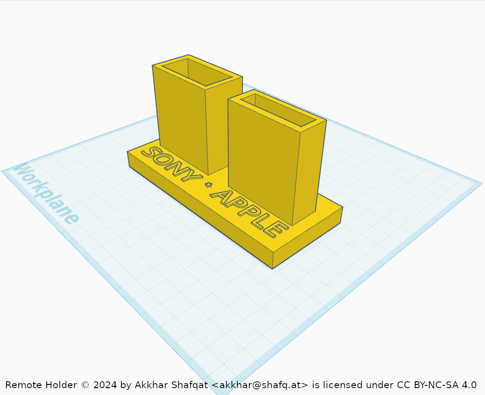

# RemoteHolder
Holds Sony and Apple TV remotes in a neat holder

## Features

- Neatly holds Sony and Apple TV remotes togeter
- Durable and stylish design

## Files
- `PRINT2/REMOTE HOLDER.svg`: 2D laser cutting file
- `PRINT3/REMOTE HOLDER.stl`: 3D object file prepared for slicer applications
- `PRINT3/REMOTE HOLDER.zip`: Compressed 3D printing object files
- `PRINT3/REMOTE HOLDER.glb`: 3D object file in GLB format

## Usaged

Place your Sony and Apple TV remotes in the holder to keep them organized and easily accessible.

## License

Remote Holder © 2024 by Akkhar Shafqat is licensed under [CC BY-NC-SA 4.0](https://creativecommons.org/licenses/by-nc-sa/4.0/?ref=chooser-v1). See,
[LICENSE](LICENSE) for details.

## Contact

For any inquiries, please contact Akkhar Shafqat at <akkhar@shafq.at>
